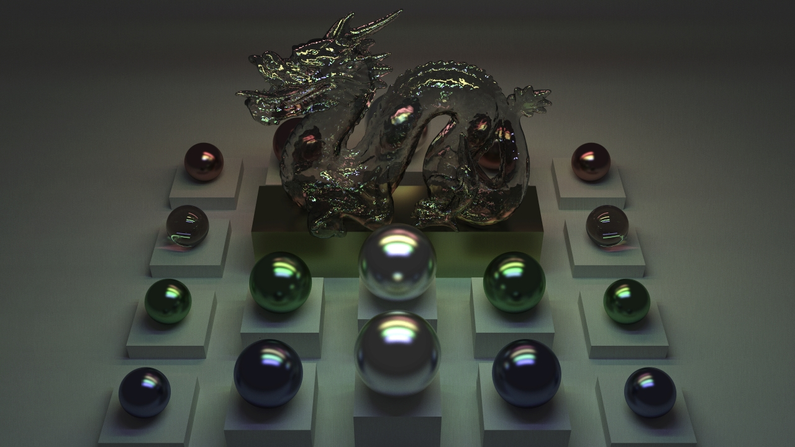
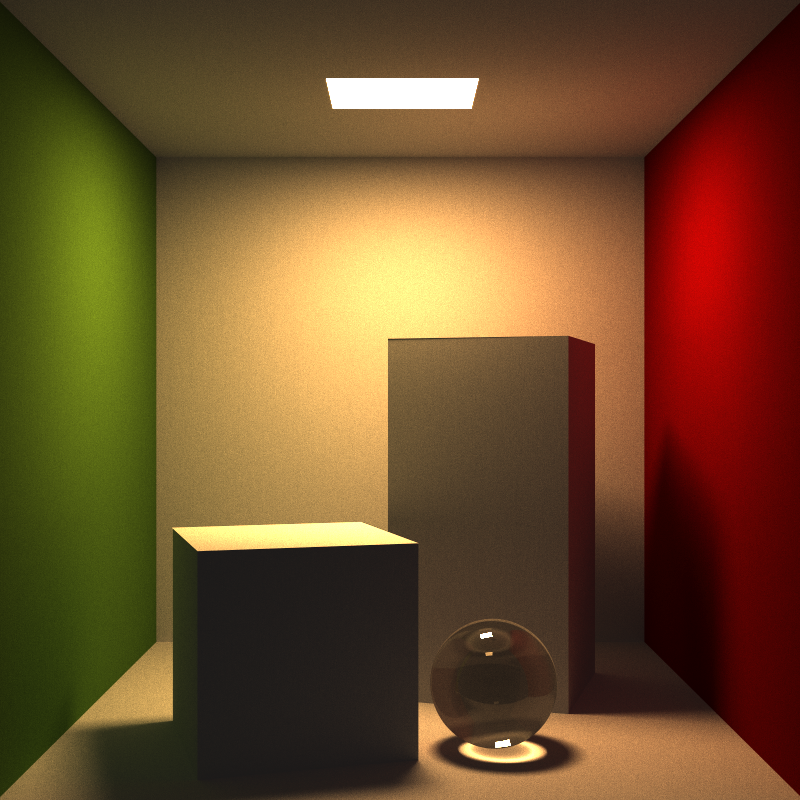

128min. on a 40 node cluster.

# RTEngine #

This is a raytracing engine written in C.

It takes advantage on multiple core and has the ability to run as part
of a cluster.

The code is very cumbersome as it was an experiment with
object-oriented programming in C (loosely based on [Schreiner](http://www.cs.rit.edu/~ats/books/ooc.pdf)'s
model). Note this does not help for performances either ;).

# Renderings #

* [Slides](http://www.slideshare.net/amaury_dlv/slides-19342945) (in French)
* [Gallery](Gallery/)

129min. on a 130 node cluster.

# Members #

* Amaury Patard de la Vieuville
* Ahmed Bougacha
* Mickael Rodrigues
* Aymeric Beaumet
